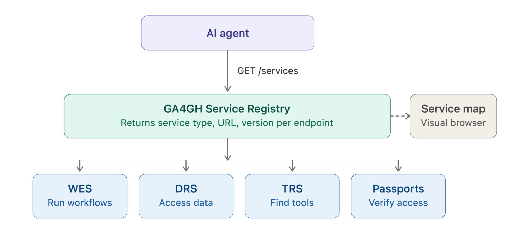

# GIF Project: Researcher Agents Using GA4GH APIs

A GA4GH Implementation Forum (GIF) project demonstrating that an AI agent, acting on behalf of a researcher, can use GA4GH's discovery and execution infrastructure to plan and carry out an end-to-end genomic analysis, entirely through standard APIs and without prior knowledge of what infrastructure is available.

**Project coordinator:** Venkat Malladi (Verily, FAWS co-lead)

## Table of contents

- [Background](#background)
  - [The problem](#the-problem)
- [Demonstration scenarios](#demonstration-scenarios)
  - [Scenario 1: Federated Cohort Query and Variant Analysis](#scenario-1-federated-cohort-query-and-variant-analysis)
  - [Scenario 2: Cross-Site Workflow Orchestration](#scenario-2-cross-site-workflow-orchestration)
  - [Additional scenarios](#additional-scenarios)
- [Timeline and roadmap (12 months)](#timeline-and-roadmap-12-months)
  - [Tracking API gaps](#tracking-api-gaps)
  - [Decisions](#decisions)
- [Getting involved](#getting-involved)

## Background

### The problem

Over the last several years we have seen the rise of development and use of Artificial Intelligence (AI) and specially Large Language Models (LLMs) to accelerate discovery and use of data and software. A central insight is that the same GA4GH standards that enable human researchers to discover data, access it, and run workflows against it, are also the natural building blocks for autonomous AI agents acting on behalf of researchers. 

The Research Agents Demonstration Using GA4GAH APIs aims to demonstrate use of AI to discover, access and compute against GA4GH and in the process make GA4GH AI-ready using the following standards:

- **Service Registry**: discover all services and standards available for use
- **Beacon v2**: query genomic variants and get comprehensive results from data providers without needing access to the original or entire dataset
- **Data Connect**: search and discover biomedical data by describing the data and its underlying model, returning references to where the actual data lives rather than the data itself
- **Passports and Visas**: communicate a user's data access authorizations based on their role, affiliation, or access status, so they're recognized across partner organizations
- **DRS**: let data consumers access datasets regardless of which repository stores or manages them, via a standard resolvable identifier
- **TRS**: exchange versioned tools and workflows for analyzing genomic data, so researchers can find and reuse them and developers can reach a wider audience
- **WES**: submit and run a defined workflow (often one registered in TRS) against a given execution environment
- **TES**: describe and dispatch batch execution tasks — a set of input files, containers/commands to run, and output files — to a compute backend
- **Refget**: retrieve reference sequences and sub-sequences via a checksum-based identifier derived from the sequence content itself, avoiding ambiguity from inconsistent naming (e.g. chr1 vs. NC_000001.11)

Together, these form the GA4GH Cloud/Discovery Work Stream toolkit: Service Registry and Data Connect help you *find* services and data, Passports/Visas handle *authorization*, DRS/Refget handle *data access*, and TRS/WES/TES handle *bringing compute to the data*.

## Demonstration scenarios

At least two end-to-end scenarios will be developed and executed. These are candidates; the group will confirm and refine them in Phase 1.

### Scenario 1: Federated Cohort Query and Variant Analysis

> Researcher prompt: "I want to find datasets that include African-ancestry participants with type 2 diabetes phenotypes and run a variant quality filtering pipeline on those samples."

Agent workflow:
- **Discovery** — query the registry MCP server for Beacon and/or Data Connect endpoints at participating sites; submit phenotype queries to find matching cohorts
- **Authorization** — retrieve GA4GH Passport visas scoped to the identified datasets; present visas to DRS servers to resolve access URLs
- **Workflow selection** — query Dockstore (TRS) for a suitable variant QC workflow available as a WES-submittable descriptor
- **Execution** — submit the WES workflow run to a participating compute site, referencing inputs via DRS URIs; monitor run status
- **Results** — return outputs (DRS-registered result files) and a run summary to the researcher

### Scenario 2: Cross-Site Workflow Orchestration

> Researcher prompt: "Run the GA4GH standard GATK germline variant calling pipeline on the WGS samples registered in site B's data catalog, using the compute available at site A."

Agent workflow:
- **Discovery** — use the registry MCP to enumerate WES endpoints at site A and DRS/Data Connect endpoints at site B
- **Tool resolution** — resolve the GATK pipeline from Dockstore via TRS, obtaining a versioned, checksummed WDL descriptor
- **Authorization** — obtain cross-site Passport visas letting the compute job at site A pull input data from site B's DRS server
- **Execution** — submit the WDL workflow to site A's WES endpoint, with DRS URIs pointing at site B's data; monitor and retrieve results

### Additional scenarios

Driver Projects and community are expected to contribute further scenarios over time, growing this into a collection of attempted agentic analyses.

## Timeline and roadmap (12 months)

| Phase | Timeframe | Key activities | Owner |
|---|---|---|---|
| **Phase 1: Setup** | Months 1–3 | Confirm participating sites and data governance agreements. Deploy/verify GA4GH Starter Kits (WES or TES, DRS, Passport) at each site. Register all site endpoints in the GA4GH implementation registry. Build and deploy the MCP server wrapping the registry. Define demonstration scenarios and success criteria with partners. Agree on open-access or synthetic datasets for each site. | — |
| **Phase 2: Integration** | Months 4–6 | Develop the agent toolchain: MCP servers for the registry, DRS, WES/TES, and Passport endpoints. Implement Scenario 1 end-to-end in a sandboxed environment with synthetic data. Test Passport-mediated cross-site authorization for WES/TES and DRS. Begin structured gap documentation on where GA4GH APIs fall short of agent needs. Host a community call presenting the integration architecture for feedback. | — |
| **Phase 3: Demonstration** | Months 7–10 | Execute Scenario 1 and Scenario 2 end-to-end across all participating sites. Instrument agent runs to capture latency, auth overhead, and error patterns. Validate that agent-executed results match expected outputs. Host a community call presenting the live demonstration and interim gap findings. Collect feedback from non-participant GA4GH Driver Projects on further use cases. | — |
| **Phase 4: Reporting** | Months 11–12 | Publish the reproducibility package: MCP servers, agent configurations, workflow descriptors, and dataset references. Deliver a structured API gap analysis to the GA4GH Cloud Work Stream (WES, DRS, Passport, Registry). Draft proposed registry extensions and an MCP compatibility specification. Present at GA4GH Plenary and/or a relevant scientific conference. Publish a blog post summarizing the demonstration, results, and lessons learned. | — |

### Tracking API gaps

The API gap report is the main outcome of this project, so we capture gaps as we hit them rather than reconstructing them at the end.

**What counts as an API gap:** anything the spec can't express or doesn't cover that we needed, or anything that forced a workaround. Examples: no standard way to write an object back through DRS, no way for a WES/TES service-info to advertise GPUs or ML frameworks, no defined machine-to-machine delegation flow for automated rounds.

**What doesn't:** a bug or missing feature in one *implementation* of a spec that the spec itself covers. File those with the implementation's own repo and link to them from here if they block us.

**How to log one:**

1. Open a new issue with the **API gap** template (`New issue` → `API gap`). It applies the `api-gap` label.
2. Add the API label (`api:drs`, `api:wes`, `api:tes`, `api:passport`, `api:trs`, `api:service-info`) and one severity label:
   - `gap:blocker`: we can't proceed without a spec change
   - `gap:workaround`: we worked around it, and the workaround should be replaced
   - `gap:nice-to-have`: works today, but a spec change would make it cleaner
3. Fill in the template: the API and version, the implementation you were using, what you tried to do, what the spec says or lacks, the workaround (if any), and a proposed change if you have one.
4. If you worked around it in code, leave a comment there pointing at the issue (`# API-GAP: #123`) so we can find and remove it later.
5. Also make an issue in the spec with proposal of how to fix and link to this issue. Will track this in a linked board.

**Triage:** the Sites and Reporting champion reviews new `api-gap` issues at each biweekly sync. Blockers are raised with the relevant spec's maintainers right away, as an issue on that spec's GitHub repo, linked back here. The final report to the Federated Analysis Work Stream and GIF project is compiled from the `api-gap` label, grouped by API.

### Decisions

Architecture and stack decisions are recorded as short notes in [`decisions/`](decisions/), one file per decision, so people who join later can see what was chosen and why. The open decisions for the hackathon are listed in [`decisions/README.md`](decisions/README.md).

## Getting involved

- **Pick up work:** issues are grouped by workstream, matching the project goals:
  - `ws:scenarios`: define and run the end-to-end agent scenarios (prompts, expected outputs, evaluation of agent runs)
  - `ws:mcp-tools`: MCP servers and agent skills wrapping the registry, Data Connect/Beacon, DRS, TRS, WES/TES, and Passports
  - `ws:auth`: Passport/Visa flows and machine-to-machine delegation for agents acting on a researcher's behalf
  - `ws:sites`: bring up, register, and verify GA4GH services at participating sites; cross-site interoperability testing
  - `ws:gaps`: API gap triage and the standards gap analysis (see [Tracking API gaps](#tracking-api-gaps))
  - `ws:docs-outreach`: reproducibility package, deployment docs, demos, community calls, and blog posts

  Good places to start:
  - Issues labeled `good-first-issue` are sized to finish in an afternoon.
  - Add one of `agent:claude`, `agent:other`, or `agent:human` to show who is working on it, so agent-assisted and human-written work can be told apart.
  - Comment on an issue before starting so two people don't collide.
  - Each issue states its inputs, a testable definition of done, and the GA4GH APIs involved (`api:*` labels), so it can be handed to a person or an AI coding agent.
  - Log any spec shortfall you hit as an `api-gap` issue rather than working around it silently.
  - Put prompts, agent configurations, and run traces in the PR or issue, so others can reproduce the result.

- **Driver Projects:** joining as a site means bringing up the node-in-a-box on a VM that the coordinator can reach, registering your synthetic partition, and being available for a coordinated training run. We'll publish a one-page "what we need from you" with the M4 runbook.
- **Sync:** slack channel #gif-ga4gh-agents, as well as a bi-weekly cadance in the AI WS and Day-to-day discussion happens in GitHub issues.

